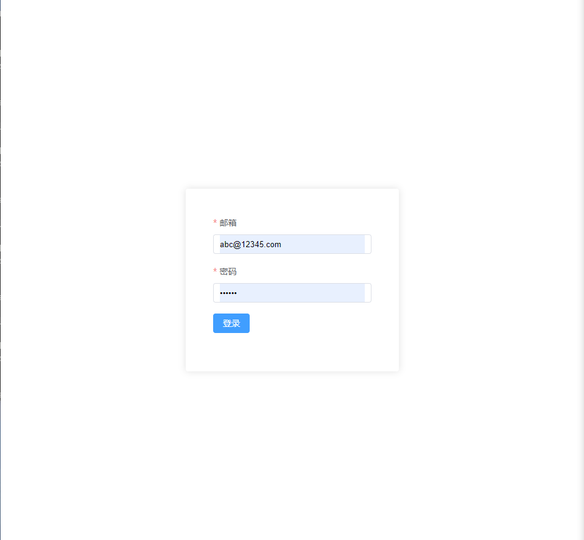
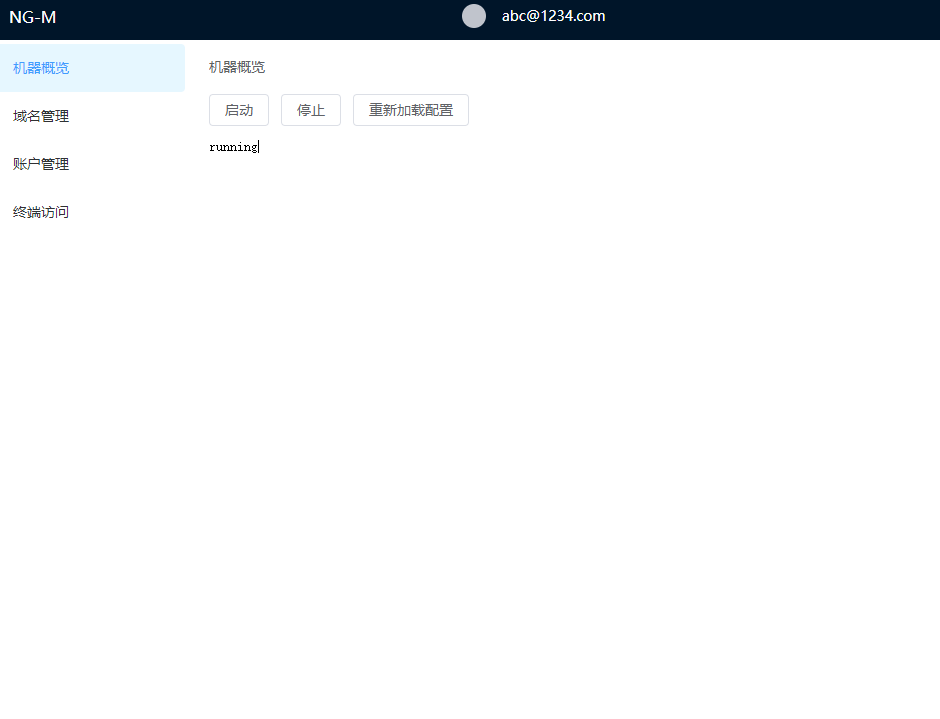
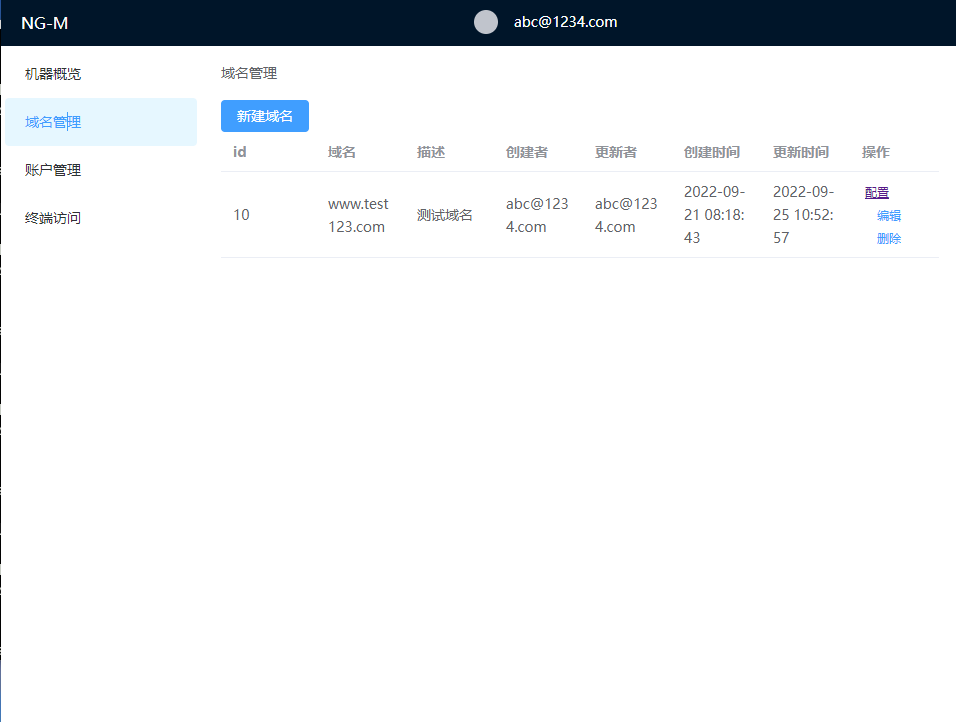
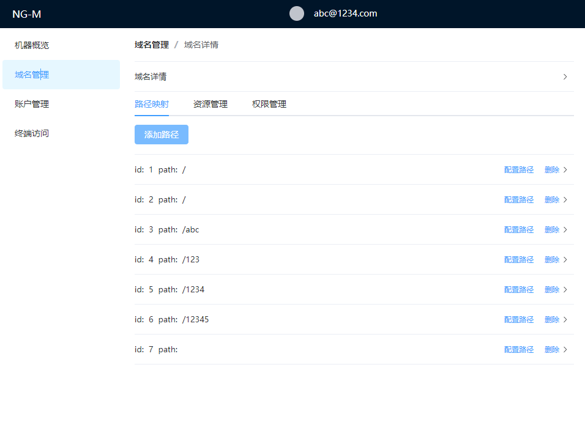
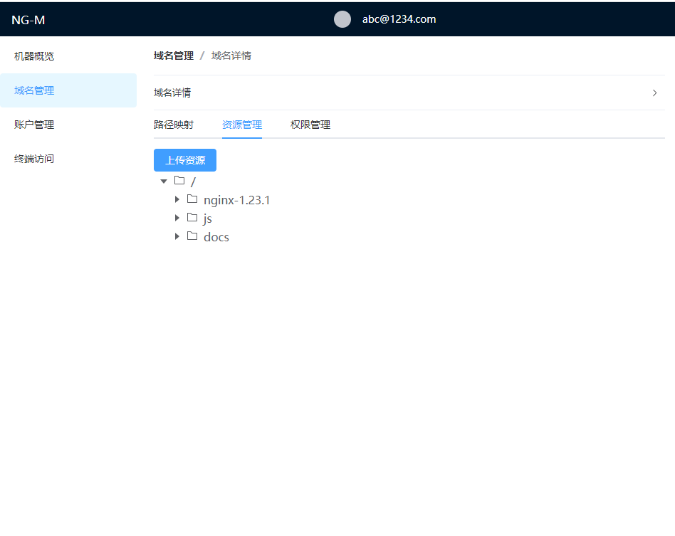
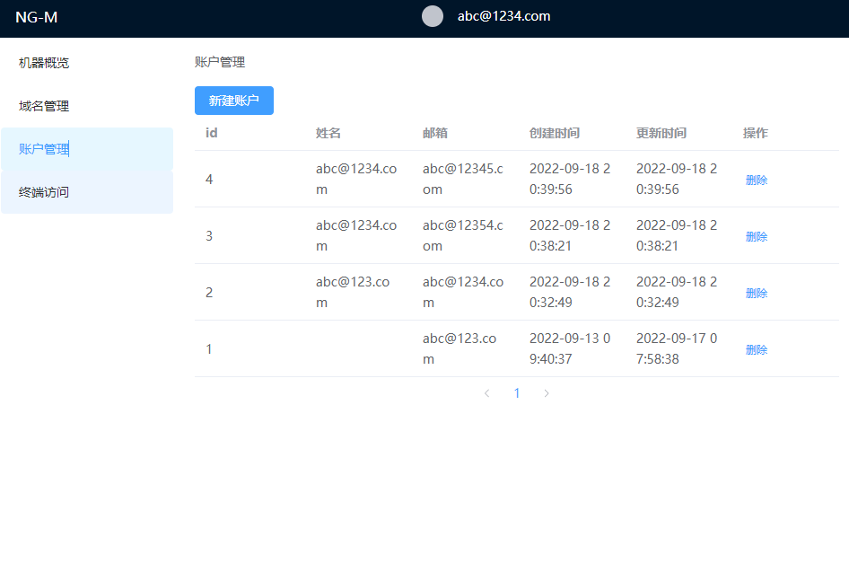
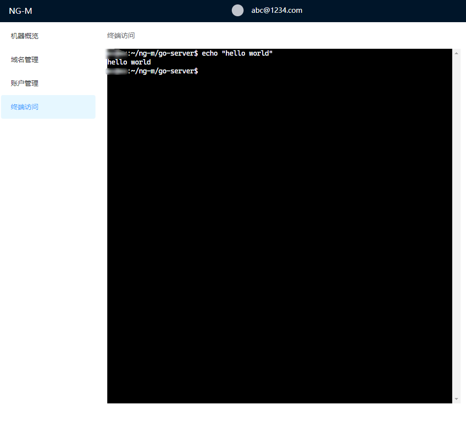

# 介绍

一个使用golang 管理nginx可视化连接ssh的web应用

# 功能

- jwt token 登录
- nginx 状态管理
- 安全，非root启动
- 域名管理
- 账户管理
- 终端连接
- 自动生成常用nginx配置


# 截图











# 开发

## 环境
ubuntu 系统
- 下载代码

```bash
git clone https://github.com/suxin2017/ng-m.git

cd script 
# 安装nginx
sudo sh ./install-ng.sh
# 将nginx所需要的目录端口进行权限配置
sudo sh ./init-env.sh

# 启动项目

cd go-server 
go mod tidy
make dev

cd vue-frontend
npm install
npm run dev
```


